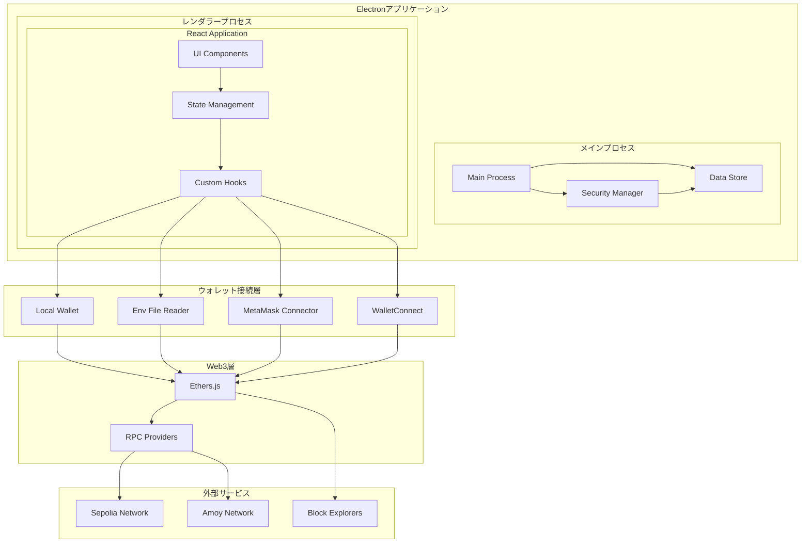

# 設計書

## 概要

ローカルでスタンドアローンで動作するweb3ウォレットアプリケーションの設計書です。ElectronベースのデスクトップアプリケーションとしてReact + TypeScriptで構築し、EVM系ネットワーク（Sepolia、Amoy）に対応します。複数のウォレット接続方法（新規作成、.envファイル、MetaMask、WalletConnect）をサポートし、スマートコントラクトのデプロイと検証機能も提供します。

## 技術スタック選定

### フロントエンド技術スタック
- **Electron**: デスクトップアプリケーション開発のため
- **React + TypeScript**: UIコンポーネントと型安全性のため
- **Vite**: 高速な開発環境とビルドツールのため

### Web3ライブラリ比較・選定

#### Web3ライブラリ選択: ethers.js vs web3.js
**選定結果: ethers.js を採用**

| 項目 | ethers.js | web3.js |
|------|-----------|---------|
| バンドルサイズ | 軽量（~300KB） | 重い（~1.5MB） |
| TypeScript対応 | ネイティブサポート | 外部型定義が必要 |
| API設計 | モジュラー、直感的 | モノリシック |
| メンテナンス | 活発 | 活発 |
| 学習コスト ウォレットアプリ | 低い | 中程度 |

**選定理由:**
- デスクトップアプリでのバンドルサイズ最適化
- TypeScriptネイティブサポートによる開発効率
- モジュラー設計による必要機能のみの使用

#### スマートコントラクト開発環境: Hardhat vs Truffle vs Foundry
**選定結果: Hardhat を採用**

| 項目 | Hardhat | Truffle | Foundry |
|------|---------|---------|---------|
| TypeScript対応 | 優秀 | 普通 | Rust/Solidity |
| デバッグ機能 | 優秀 | 普通 | 優秀 |
| プラグインエコシステム | 豊富 | 豊富 | 限定的 |
| コンパイル速度 | 普通 | 遅い | 高速 |
| 学習コスト | 低い | 中程度 | 高い |
| Electron統合 | 容易 | 容易 | 困難 |

**選定理由:**
- TypeScriptとの親和性が高い
- Electronアプリ内でのコンパイル・デプロイが容易
- 豊富なプラグインによる拡張性
- 検証機能の統合が簡単

### 最終技術スタック
- **ethers.js**: Ethereumとの相互作用（軽量、型安全）
- **Hardhat**: スマートコントラクト開発・コンパイル・デプロイ
- **@walletconnect/client**: WalletConnect統合
- **bip39**: ニーモニックフレーズ生成・検証

### セキュリティとストレージ
- **crypto-js**: 暗号化・復号化
- **electron-store**: 安全なローカルデータ保存
- **dotenv**: 環境変数読み込み

### UI/UXライブラリ
- **Material-UI (MUI)**: 一貫したUIコンポーネント
- **qrcode**: QRコード生成
- **react-qr-scanner**: QRコードスキャン機能

### コントラクト検証
- **axios**: ブロックエクスプローラーAPI通信
- **@hardhat/verify**: コントラクト検証プラグイン

## アーキテクチャ

### 全体アーキテクチャ



### レイヤー構成

1. **プレゼンテーション層**: React UIコンポーネント
2. **アプリケーション層**: ビジネスロジックとstate管理
3. **ウォレット接続層**: 各種ウォレット接続の抽象化
4. **Web3層**: ブロックチェーンとの相互作用
5. **データ層**: ローカルストレージとセキュリティ

## コンポーネントとインターフェース

### 主要コンポーネント

#### 1. ウォレット管理コンポーネント
```typescript
interface WalletManager {
  // ウォレット接続方法の選択
  selectConnectionMethod(method: ConnectionMethod): Promise<void>
  
  // 新しいウォレット作成
  createNewWallet(password: string): Promise<WalletInfo>
  
  // .envファイルからウォレット読み込み
  loadFromEnvFile(filePath: string): Promise<WalletInfo>
  
  // MetaMask接続
  connectMetaMask(): Promise<WalletInfo>
  
  // WalletConnect接続
  connectWalletConnect(): Promise<WalletInfo>
  
  // ウォレットロック/アンロック
  lockWallet(): void
  unlockWallet(password: string): Promise<boolean>
}
```

#### 2. トランザクション管理コンポーネント
```typescript
interface TransactionManager {
  // 残高取得
  getBalance(address: string, tokenAddress?: string): Promise<Balance>
  
  // トランザクション送信
  sendTransaction(params: SendTransactionParams): Promise<TransactionResult>
  
  // ガス料金見積もり
  estimateGas(params: TransactionParams): Promise<GasEstimate>
  
  // トランザクション履歴取得
  getTransactionHistory(address: string): Promise<Transaction[]>
}
```

#### 3. コントラクト管理コンポーネント
```typescript
interface ContractManager {
  // コントラクトデプロイ
  deployContract(params: DeployParams): Promise<DeployResult>
  
  // コントラクト検証
  verifyContract(params: VerifyParams): Promise<VerificationResult>
  
  // コンパイル
  compileContract(sourceCode: string, settings: CompilerSettings): Promise<CompilationResult>
}
```

#### 4. ネットワーク管理コンポーネント
```typescript
interface NetworkManager {
  // ネットワーク切り替え
  switchNetwork(networkId: NetworkId): Promise<void>
  
  // 現在のネットワーク取得
  getCurrentNetwork(): Network
  
  // サポートされているネットワーク一覧
  getSupportedNetworks(): Network[]
}
```

### データモデル

#### ウォレット情報
```typescript
interface WalletInfo {
  address: string
  connectionMethod: ConnectionMethod
  isLocked: boolean
  networkId: NetworkId
}

enum ConnectionMethod {
  NEW_WALLET = 'new_wallet',
  ENV_FILE = 'env_file',
  METAMASK = 'metamask',
  WALLET_CONNECT = 'wallet_connect'
}
```

#### ネットワーク設定
```typescript
interface Network {
  id: NetworkId
  name: string
  rpcUrl: string
  chainId: number
  blockExplorerUrl: string
  nativeCurrency: {
    name: string
    symbol: string
    decimals: number
  }
}

enum NetworkId {
  SEPOLIA = 'sepolia',
  AMOY = 'amoy'
}
```

#### トランザクション
```typescript
interface Transaction {
  hash: string
  from: string
  to: string
  value: string
  gasPrice: string
  gasUsed: string
  timestamp: number
  status: TransactionStatus
  networkId: NetworkId
}
```

## エラーハンドリング

### エラー分類
1. **ネットワークエラー**: RPC接続失敗、タイムアウト
2. **認証エラー**: パスワード不正、ウォレット未接続
3. **トランザクションエラー**: 残高不足、ガス不足
4. **検証エラー**: コントラクト検証失敗
5. **システムエラー**: ファイル読み込み失敗、暗号化エラー

### エラーハンドリング戦略
```typescript
interface ErrorHandler {
  // エラー分類
  classifyError(error: Error): ErrorType
  
  // ユーザー向けメッセージ生成
  generateUserMessage(error: Error): string
  
  // リトライ可能性判定
  isRetryable(error: Error): boolean
  
  // エラーログ記録
  logError(error: Error, context: string): void
}
```

## テスト戦略

### テストレベル
1. **単体テスト**: 各コンポーネントの個別機能
2. **統合テスト**: コンポーネント間の連携
3. **E2Eテスト**: ユーザーシナリオの完全なフロー

### テスト対象
- ウォレット作成・インポート機能
- トランザクション送受信
- ネットワーク切り替え
- コントラクトデプロイ・検証
- セキュリティ機能（暗号化・復号化）

### テストツール
- **Jest**: 単体テスト・統合テスト
- **React Testing Library**: Reactコンポーネントテスト
- **Playwright**: E2Eテスト
- **MSW**: APIモック

## セキュリティ設計

### 暗号化戦略
1. **秘密鍵暗号化**: AES-256-GCMでパスワードベース暗号化
2. **ローカルストレージ**: Electronの安全なストレージ使用
3. **メモリ管理**: 機密データの適切なクリア

### セキュリティ対策
```typescript
interface SecurityManager {
  // データ暗号化
  encrypt(data: string, password: string): Promise<string>
  
  // データ復号化
  decrypt(encryptedData: string, password: string): Promise<string>
  
  // パスワード強度チェック
  validatePasswordStrength(password: string): PasswordStrength
  
  // 自動ロック管理
  setupAutoLock(timeoutMinutes: number): void
}
```

### プライバシー保護
- 秘密鍵はローカルのみに保存
- ネットワーク通信は必要最小限
- ユーザーデータの外部送信なし

## パフォーマンス最適化

### 最適化戦略
1. **遅延読み込み**: 大きなコンポーネントの動的インポート
2. **メモ化**: 計算結果のキャッシュ
3. **バッチ処理**: 複数のブロックチェーン呼び出しの最適化
4. **状態管理**: 不要な再レンダリングの防止

### リソース管理
```typescript
interface ResourceManager {
  // RPC接続プール管理
  manageRpcConnections(): void
  
  // メモリ使用量監視
  monitorMemoryUsage(): void
  
  // キャッシュ管理
  manageCacheLifecycle(): void
}
```

## 国際化対応

### 多言語サポート
- 日本語・英語対応
- React i18nextを使用
- 動的言語切り替え

### ローカライゼーション
```typescript
interface LocalizationManager {
  // 言語設定
  setLanguage(language: Language): void
  
  // 翻訳取得
  translate(key: string, params?: object): string
  
  // 数値・日付フォーマット
  formatNumber(value: number): string
  formatDate(date: Date): string
}
```