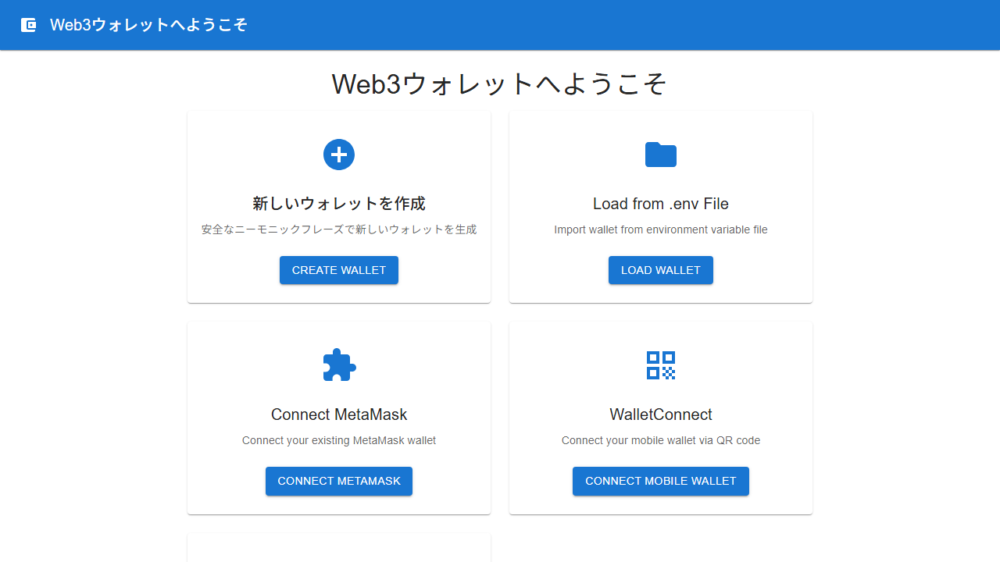

# Web3 Wallet Application



A standalone Web3 wallet application built with Electron, React, and TypeScript. This application provides secure wallet management with support for multiple connection methods and blockchain networks. The interface is available in Japanese and English.

## Features

- **Multiple Wallet Connection Methods**:
  - Create new wallet with mnemonic phrase
  - Import from .env file
  - MetaMask integration
  - WalletConnect support
  - Wallet recovery via mnemonic phrase

- **Blockchain Network Support**:
  - Sepolia Testnet
  - Polygon Amoy Testnet

- **Security Features**:
  - Password-protected encrypted storage
  - Secure mnemonic phrase generation
  - Auto-lock functionality
  - Local-only storage (no external dependencies)
  - Password strength validation

- **Core Functionality**:
  - Balance checking with automatic refresh
  - Send/receive transactions
  - Transaction history
  - Smart contract deployment and verification
  - QR code generation for addresses
  - Performance monitoring

- **User Interface**:
  - Multi-language support (Japanese/English)
  - Responsive design
  - Material-UI components
  - Error handling and validation
  - Loading states and progress indicators

## Installation

1. Clone the repository
2. Install dependencies:
   ```bash
   npm install
   ```

## Development

To run the application in development mode:

```bash
npm run dev
```

This will:
- Automatically kill any existing processes on port 3000
- Start the Vite development server
- Perform health checks to ensure the server is ready
- Display confirmation when ready for testing

Alternative commands:
```bash
npm run dev:safe     # Run main and renderer processes separately
npm run dev:main     # Run Electron main process only
npm run dev:renderer # Run Vite renderer process only
```

## Building

To build the application for production:

```bash
npm run build
```

This will build both the main process and renderer process.

## Testing

Run unit tests with:

```bash
npm test
npm run test:watch  # Watch mode
```

Run end-to-end tests with Playwright:

```bash
npm run e2e
```

### Code Quality

Check code quality and types:

```bash
npm run lint      # ESLint
npm run typecheck # TypeScript type checking
```

## Usage

### Creating a New Wallet

1. Launch the application
2. Click "新しいウォレットを作成" (Create New Wallet)
3. Set a secure password (minimum 8 characters with uppercase, lowercase, number, and special character)
4. Confirm your password
5. Save the generated mnemonic phrase securely
6. Access your wallet dashboard

### Importing from .env File

1. Create a `.env` file with your private key:
   ```
   PRIVATE_KEY=0xyourprivatekeyhere
   ```
2. Click "Load from .env File"
3. Select your `.env` file
4. Access your wallet dashboard

### Using MetaMask

1. Ensure MetaMask is installed and unlocked
2. Click "Connect MetaMask"
3. Approve the connection request
4. Access your wallet dashboard

### Using WalletConnect

1. Click "WalletConnect"
2. Scan the QR code with your mobile wallet
3. Approve the connection on your mobile device
4. Access your wallet dashboard

### Wallet Recovery

1. Click "Recover Wallet"
2. Enter your mnemonic phrase
3. Set a new password
4. Access your recovered wallet

## Security Considerations

- **Never share your private keys or mnemonic phrases**
- **Use strong passwords for wallet encryption**
- **Keep your mnemonic phrase in a secure, offline location**
- **This application is for educational/testing purposes on testnets**
- **Always verify transaction details before signing**

## Supported Networks

- **Sepolia Testnet**: Ethereum testnet for development
- **Polygon Amoy Testnet**: Polygon testnet for development

## Architecture

### File Structure

```
src/
├── components/          # React components
│   ├── layouts/         # Layout components
│   ├── WalletConnection.tsx
│   ├── Dashboard.tsx
│   ├── SendTransaction.tsx
│   ├── ReceiveTransaction.tsx
│   ├── TransactionHistory.tsx
│   ├── TokenBalance.tsx
│   ├── ContractDeployment.tsx
│   ├── ContractVerification.tsx
│   ├── BackupWallet.tsx
│   ├── WalletRecovery.tsx
│   └── ErrorDisplay.tsx
├── contexts/           # React contexts
│   ├── WalletContext.tsx
│   └── I18nContext.tsx
├── services/           # Business logic services
│   ├── WalletService.ts
│   ├── BalanceService.ts
│   ├── TransactionService.ts
│   ├── ContractService.ts
│   ├── ContractVerificationService.ts
│   └── WalletConnectService.ts
├── types/             # TypeScript type definitions
│   ├── index.ts
│   └── global.d.ts
├── utils/             # Utility functions
│   ├── crypto.ts
│   ├── errorHandler.ts
│   ├── i18n.ts
│   └── networks.ts
├── hooks/             # Custom React hooks
│   ├── useBalance.ts
│   ├── usePerformance.ts
│   ├── useErrorHandler.ts
│   └── useAutoLock.ts
└── __tests__/         # Test files

electron/
├── main.ts            # Electron main process
└── preload.ts         # Electron preload script

e2e/
├── wallet-connection.spec.ts  # E2E tests
└── simple-test.spec.ts       # Screenshot tests
```

### Key Components

- **WalletContext**: Global wallet state management
- **I18nContext**: Multi-language support
- **WalletService**: Core wallet operations
- **BalanceService**: Balance checking and caching
- **TransactionService**: Transaction handling
- **ContractService**: Smart contract operations
- **Performance Hooks**: Monitoring and optimization

## Development Scripts

```bash
# Development
npm run dev              # Start development server with health checks
npm run dev:safe         # Start with separate processes
npm run dev:main         # Electron main process only
npm run dev:renderer     # Vite renderer only

# Building
npm run build           # Build for production
npm run build:main      # Build main process
npm run build:renderer  # Build renderer process
npm run preview         # Preview production build

# Testing
npm test               # Run unit tests
npm run test:watch     # Watch mode
npm run e2e           # End-to-end tests
npm run lint          # ESLint
npm run typecheck     # Type checking
```

## Performance Features

- **Memory Optimization**: Automatic cleanup of unused resources
- **Performance Monitoring**: Built-in performance tracking
- **Debounced/Throttled Operations**: Optimized API calls
- **Lazy Loading**: Components loaded on demand
- **Caching**: Balance and transaction caching

## Internationalization

The application supports multiple languages:
- **Japanese (ja)**: Default language
- **English (en)**: Alternative language

Language can be changed through the settings or by modifying the I18nContext.

## Error Handling

Comprehensive error handling includes:
- Network connection errors
- Wallet operation failures
- Transaction errors
- Validation errors
- User-friendly error messages in multiple languages

## License

MIT License - see LICENSE file for details

## Contributing

This project is part of a learning exercise. Feel free to explore and modify the code for educational purposes.

## Disclaimer

This software is provided for educational and testing purposes only. Do not use with real funds or on mainnet without proper security auditing.